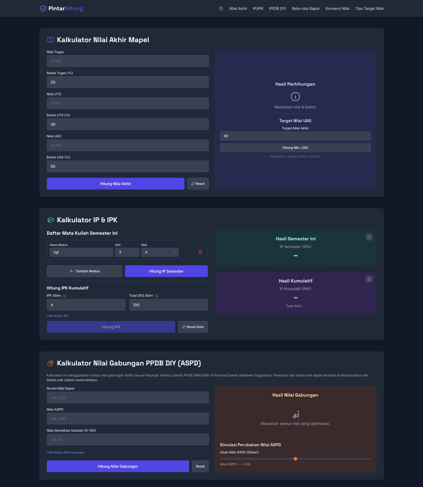

# 🎓 PintarHitung - Kalkulator Nilai Akademik

[](https://github.com/pintarhitung/PintarHitung.github.io/actions/workflows/pages/pages-build-deployment)

🔗 Website ini dapat diakses langsung melalui:  
**[https://PintarHitung.github.io/](https://PintarHitung.github.io/)**

---

## 📘 Tentang PintarHitung

**PintarHitung** adalah website kalkulator nilai akademik yang dirancang khusus untuk membantu pelajar dan mahasiswa di Indonesia. Tujuan utama proyek ini adalah menyediakan alat bantu perhitungan nilai yang:

- ✅ **Mudah Digunakan** – Antarmuka yang simpel dan intuitif  
- ⚡ **Interaktif** – Hasil perhitungan diperbarui secara dinamis  
- 🧩 **Modern** – Tampilan yang bersih dan responsif  

Website ini dibangun menggunakan teknologi web front-end standar dan dihosting gratis menggunakan GitHub Pages.

---

## ✨ Fitur Kalkulator

Saat ini, PintarHitung menyediakan beberapa jenis kalkulator:

- 📊 **Kalkulator Nilai Akhir**  
  Menghitung nilai akhir mata pelajaran/kuliah berdasarkan bobot tugas, UTS, dan UAS. Termasuk fitur untuk menghitung target nilai UAS minimum yang dibutuhkan.

- 🎓 **Kalkulator IP & IPK**  
  Menghitung Indeks Prestasi (IP) semester dan Indeks Prestasi Kumulatif (IPK) berdasarkan SKS dan nilai huruf. Data disimpan otomatis di browser (Local Storage).

- 🏫 **Kalkulator Nilai Gabungan PPDB DIY (ASPD)**  
  Alat bantu menghitung nilai gabungan PPDB SMA/SMK di Yogyakarta berdasarkan nilai rapor, ASPD, dan akreditasi sekolah.

- 📝 **Kalkulator Rata-rata Rapor**  
  Menghitung rata-rata nilai dari seluruh mata pelajaran selama beberapa semester.

- 🔄 **Konversi Nilai**  
  Mengkonversi nilai angka (0-100) menjadi nilai huruf (A, B+, dst.) berdasarkan skala standar nasional.

---

## 🖼️ Tampilan

  

---

## 🛠️ Teknologi yang Digunakan

- **HTML5**
- **CSS3**
- **Tailwind CSS** – Utility-first CSS framework (via CDN)
- **JavaScript** – Bahasa utama logika kalkulator
- **Alpine.js** – Framework ringan untuk interaktivitas (via CDN)
- **AOS (Animate On Scroll)** – Efek animasi saat scroll (via CDN)
- **GitHub Pages** – Hosting gratis untuk website statis

---

## 🧪 Menjalankan Secara Lokal

1. **Clone Repositori**
   ```bash
   git clone https://github.com/pintarhitung/PintarHitung.github.io.git
Buka File HTML Arahkan ke folder hasil clone, lalu buka file index.html (atau y.html, jika itu nama file utama Anda) di browser.

✅ Tidak perlu install dependensi atau build karena semua library dimuat via CDN.

📄 Lisensi
Proyek ini dilisensikan di bawah MIT License.
(Opsional: Anda bisa memilih lisensi lain atau menghapus bagian ini jika tidak digunakan.)

👤 Author
Dikembangkan oleh Fawwaz Dzaky.
Jika Anda menemukan bug atau memiliki saran, silakan buat Issue di repositori ini. Kontribusi sangat terbuka!
